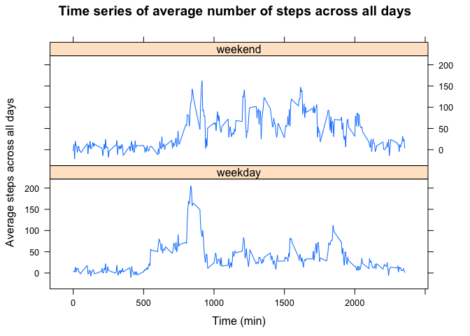

## Loading and preprocessing the data
1. Load the data (i.e. read.csv())
2. Process/transform the data (if necessary) into a format suitable for your analysis


```r
actdata <- read.csv("activity.csv", na.strings = "NA", stringsAsFactors = FALSE)
actdata$date <- as.Date(actdata$date)
```

## What is mean total number of steps taken per day?
1. Calculate the total number of steps taken per day
2. Make a histogram of the total number of steps taken each day
3. Calculate and report the mean and median total number of steps taken per day


```r
library(dplyr)
actdata <- tbl_df(actdata)
actdata <- group_by(actdata, date)
steptotal <- summarize(actdata, Total_steps = sum(steps, na.rm = TRUE))
plot(steptotal$date, steptotal$Total_steps,
     type = "h",
     lwd = 3,
     main = "Histogram of the total number of steps taken each day",
     xlab = "Date",
     ylab = "Total steps")
abline(h = mean(steptotal$Total_steps), col = "magenta")
abline(h = median(steptotal$Total_steps), col = "cyan")
legend("topleft", legend = c("Mean", "Median"),
       col = c("magenta", "cyan"), lty = 1, cex = 0.75)
```

<!-- -->

```r
print(paste("The mean of total number of steps taken per day is", mean(steptotal$Total_steps)))
print(paste("The median of total number of steps taken per day is", median(steptotal$Total_steps)))
```

```
## [1] "The mean of total number of steps taken per day is 9354.22950819672"
## [1] "The median of total number of steps taken per day is 10395"
```

## What is the average daily activity pattern?
1. Make a time series plot (i.e. type = "l") of the 5-minute interval (x-axis) and the average number of steps taken, averaged across all days (y-axis)
2. Which 5-minute interval, on average across all the days in the dataset, contains the maximum number of steps?


```r
ungroup(actdata)
actdata <- group_by(actdata, interval)
stepaverage <- summarize(actdata, Average_steps = mean(steps, na.rm = TRUE))
plot(stepaverage$interval, stepaverage$Average_steps,
     type = "l",
     main = "Time series of average number of steps across all days",
     xlab = "Time (min)",
     ylab = "Average steps across all days")
```

<!-- -->

```r
maxinterval <- stepaverage[which.max(stepaverage$Average_steps), 1]
print(paste(maxinterval, "interval contains the maximum number of steps."))
```

```
## [1] "835 interval contains the maximum number of steps."
```

## Imputing missing values
1. Calculate and report the total number of missing values in the dataset (i.e. the total number of rows with NAs)
2. Devise a strategy for filling in all of the missing values in the dataset. The strategy does not need to be sophisticated. For example, you could use the mean/median for that day, or the mean for that 5-minute interval, etc.
3. Create a new dataset that is equal to the original dataset but with the missing data filled in.
4. Make a histogram of the total number of steps taken each day and Calculate and report the mean and median total number of steps taken per day. Do these values differ from the estimates from the first part of the assignment? What is the impact of imputing missing data on the estimates of the total daily number of steps?

**After imputing missing data, the values differ from the data with missing values. Specifically, more daily number of steps value are non-zero due to imputed data. However, due to the low percentage of missing values in the original data, the overall pattern is not much affected.**


```r
library(mice)
nacount <- nrow(actdata) - sum(complete.cases(actdata))
print(paste("Total number of missing values is", nacount))
```

```
## [1] "Total number of missing values is 2304"
```

```r
tempactdata <- mice(actdata, method = "norm")
completeactdata <- tbl_df(complete(tempactdata))
completeactdata <- group_by(completeactdata, date)
steptotal1 <- summarize(completeactdata, Total_steps = sum(steps))
plot(steptotal1$date, steptotal1$Total_steps,
     type = "h",
     lwd = 3,
     main = "Histogram of the total number of steps taken each day",
     xlab = "Date",
     ylab = "Total steps")
abline(h = mean(steptotal1$Total_steps), col = "magenta")
abline(h = median(steptotal1$Total_steps), col = "cyan")
legend("topleft", legend = c("Mean", "Median"),
       col = c("magenta", "cyan"), lty = 1, cex = 0.75)
```

<!-- -->

## Are there differences in activity patterns between weekdays and weekends?
1. Create a new factor variable in the dataset with two levels -- "weekday" and "weekend" indicating whether a given date is a weekday or weekend day.
2. Make a panel plot containing a time series plot (i.e. type = "l") of the 5-minute interval (x-axis) and the average number of steps taken, averaged across all weekday days or weekend days (y-axis). The plot should look something like the following, which was created using simulated data:


```r
library(chron)
library(lattice)
actdata <- mutate(completeactdata, weekday = is.weekend(date))
actdata$weekday <- as.factor(actdata$weekday)
levels(actdata$weekday) <- c("weekday", "weekend")
ungroup(actdata)
actdata <- group_by(actdata, interval, weekday)
stepaverage1 <- summarize(actdata, Average_steps = mean(steps))
xyplot(Average_steps ~ interval | weekday,
       data = stepaverage1,
       type = "l",
       layout = c(1, 2),
       main = "Time series of average number of steps across all days",
       xlab = "Time (min)",
       ylab = "Average steps across all days")
```

<!-- -->
